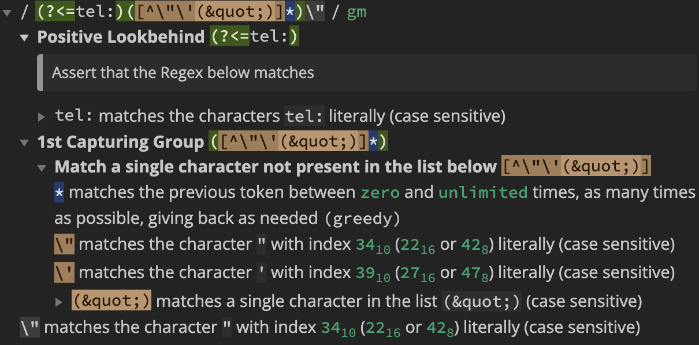
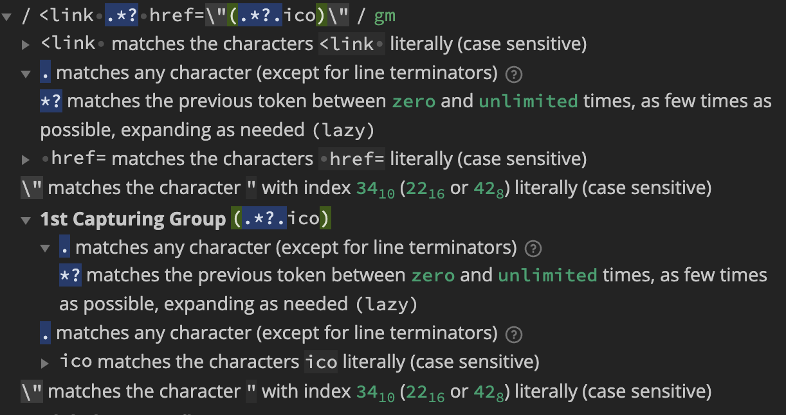

# phone_finder

Phone finder is a Python scraper script that obtains the logo and phone numbers on the site using asynchronicity.

## Installation

Use the platform [Docker](https://docs.docker.com/desktop/install/mac-install/) to run phone finder.

```bash
docker build -t phone_finder .
```

## Run project

Create a text file with all websites you want to scraper
example
```bash
#websites.txt
https://www.oreilly.com/
https://radimrehurek.com/gensim/
...
```

And use the Docker to run
```bash
cat websites.txt | docker run -i phone_finder
```
## Patterns and Libs
For Project Patterns the script uses Controller Pattern and KISS principle.


The phone finder © uses [requests-futures](https://pypi.org/project/requests-futures/) as http library because assyncronous implementation in the I/O operations and symple use; And for extract data uses [re](https://docs.python.org/3/library/re.html) library for regular expression operations because it is fast, best mathematician way to find patterns in a string, simple to change and it is used by other complex libs (beautifulSoup, html-parse, lxml), having a only disadvantages that is not simplest way to debug but not impossible.


## Regex explanations

### phone regex


### icon regex
